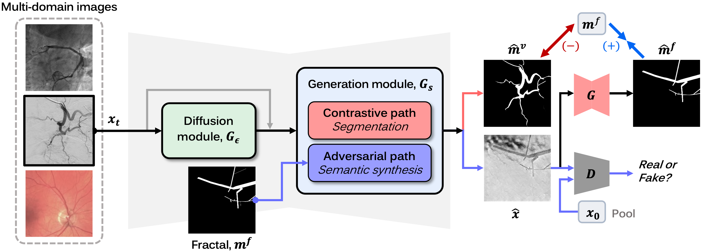

# MEDIA_CDARL
Official repository for "C-DARL: Contrastive diffusion adversarial representation learning for label-free blood vessel segmentation"
[[arXiv](https://arxiv.org/abs/2308.00193)][[Medical Image Analysis](https://www.sciencedirect.com/science/article/pii/S1361841523002827?dgcid=coauthor)]



## Requirements
  * OS : Ubuntu
  * Python >= 3.9
  * PyTorch >= 1.12.1

## Data
In our experiments, we used the publicly available XCAD dataset. Please refer to our main paper.

## Training

To train our model, run this command:

```train
python3 main.py -p train -c config/train.json
```

## Test

To test the trained our model, run:

```eval
python3 main.py -p test -c config/test.json
```

## Pre-trained Models

You can download our pre-trained model of the XCAD dataset [here](https://drive.google.com/file/d/180xRhnpAsT6ZrM-FrMTZ6AVkqnfBBqYm/view?usp=sharing).
Then, you can test the model by saving the pre-trained weights in the directory ./experiments/pretrained_model.
To briefly test our method given the pre-trained model, we provided the toy example in the directory './data/'.

## Citations

```
@article{kim2024cdarl,
title = {C-DARL: Contrastive diffusion adversarial representation learning for label-free blood vessel segmentation},
journal = {Medical Image Analysis},
volume = {91},
pages = {103022},
year = {2024},
issn = {1361-8415},
doi = {https://doi.org/10.1016/j.media.2023.103022},
author = {Boah Kim and Yujin Oh and Bradford J. Wood and Ronald M. Summers and Jong Chul Ye}
}
```

